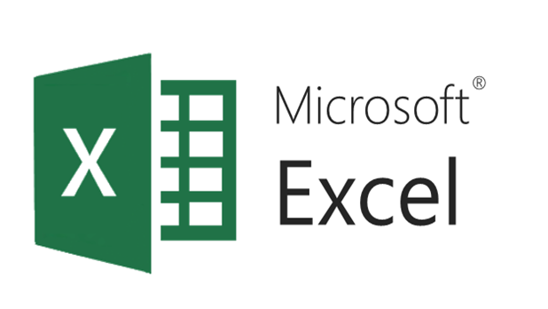
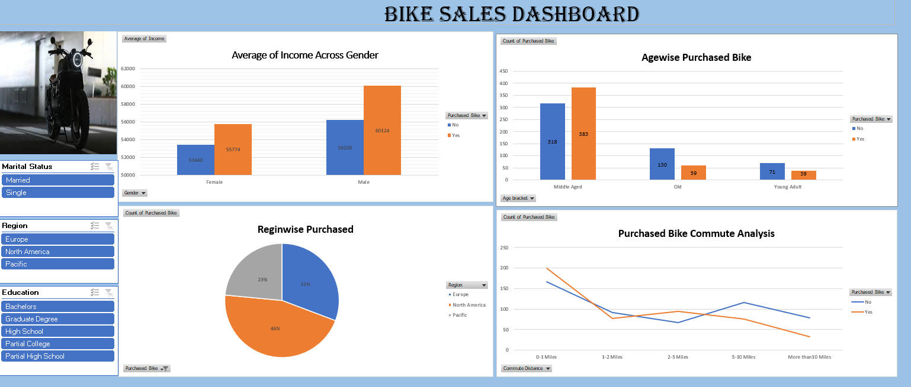

# Bike_sales_Analysis

&nbsp;

## Overview : 
This dashboard is for presenting my insights to the regional manager of the coffee chain with 3 different stores.I have created a dashboard which can help me discuss the operations of these stores with my higher-ups. This will be done solely to optimize the operations.

## Tool used :
&nbsp;

## Insights :
- Higher Male Income: Men have a significantly higher average income, potentially indicating greater purchasing power for bikes.

- Middle-Aged Lead Purchases: Middle-aged individuals are the primary bike purchasers.

- Europe Dominates: Europe is the strongest market for bike sales.

- Short Commutes Less Likely to Drive Purchases: People with very short commutes (0-1 mile) are less likely to buy bikes.

- Moderate Commutes Show Promise: Bike purchases increase for commute distances between 1-5 miles.

## Recommendations:

- Target Middle-Aged Males: Tailor marketing and products towards this demographic with higher income and purchase propensity.
  
- Focus on European Market: Invest further in the European market, understanding its specific demands.

- Promote Commuting Benefits (1-5 Miles): Highlight the advantages of biking for moderate commutes (health, cost savings, environment) to increase sales in this segment.

- Explore Incentives for Short Commuters: Investigate why short commuters aren't buying and consider targeted promotions or bike types that might appeal to them (e.g., foldable bikes for mixed commutes).

- Consider Regional Strategies: Analyze the specific needs and preferences within Europe, North America, and the Pacific to refine marketing and product offerings accordingly.

## Dashboard :
&nbsp;
